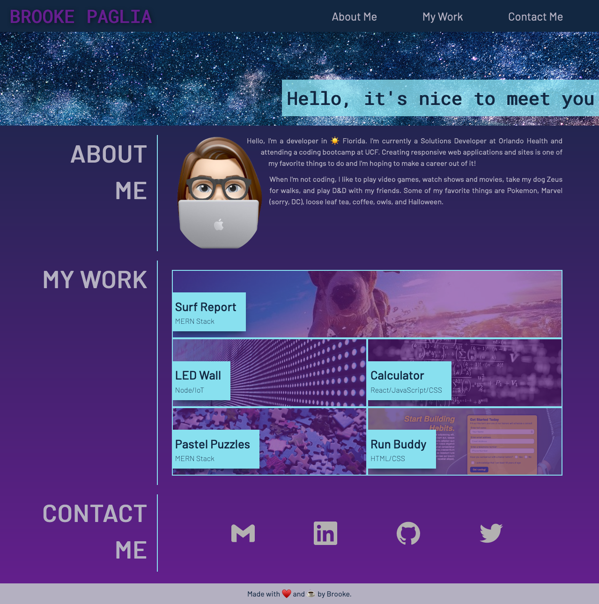

# Personal Portfolio

## Description

The purpose of this project is to create a responsive, professional portfolio which showcases my development work, while also reflecting my personality. This site will also provide a sandbox for me to practice and improve my development skills.

## Credits

- Color Palette: [Color Hunt](https://colorhunt.co/)
- Fonts: [Google Fonts](https://fonts.google.com)
- Images: [pixabay](https://pixabay.com/)
- Social Media Icons: [simpleicons.org](https://simpleicons.org/)

## Live Site
[Personal Portfolio](https://brookescodestuff.github.io/personal-portfolio/)

## Badges

## Screenshot

